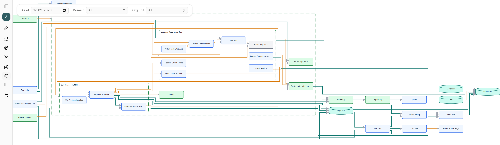

# OpenEAM

Self-hosted, open-source Enterprise Architecture Management.



Enterprise architecture tools tend to be expensive, hosted by somebody else, and
shaped around a methodology you have to adopt whole. OpenEAM is a small
self-hosted alternative: model what your organization is able to do — its
capabilities, value streams and processes — map that to the systems actually
realizing it, and keep the two connected as both change. Everything is scoped to
an **enterprise**, the scope of one architecture effort, which can be a corporate
group, a single department, or a household.

## The part that makes it different

Every relationship in the model carries a validity interval. So the landscape is
not a picture of today that you edit over time — it is reconstructible for **any
date**, and the `as of` control in the screenshot above is not a filter. Set it to
last year and you see what ran where last year, including the systems that have
since been retired.

That turns questions architects normally answer from memory into questions the
model answers: *what is still running on the platform we are switching off, and
what breaks if we do?*

## What works today

Business capabilities, value streams with stages, and business processes with
real BPMN modelling. An architecture landscape of building blocks — split into
architecture building blocks (the need) and solution building blocks (the product
meeting it) — with typed relationships between them (*depends on*, *exchanges data
with*, *runs on*), automatic diagram layout, and export/import of a whole
enterprise as a JSON bundle.

It is genuinely early. **There is no authentication of any kind yet**, so run it
on a machine you control and don't expose it to a network you don't. The apps
aren't containerized yet either — see [docs/BACKLOG.md](docs/BACKLOG.md) for what
is known to be missing.

## Run it

Needs Node 24 and pnpm 11 (`.node-version` pins Node; we use
[fnm](https://github.com/Schniz/fnm)), plus Docker for Postgres.

```bash
cp .env.example .env
pnpm install
docker compose up -d   # Postgres
pnpm db:migrate
pnpm dev
```

- Web: http://localhost:3000
- GraphQL: http://localhost:4000/graphql

## See it with data

Two example models live in [examples/](examples/). `POST` either to
`/api/data-exchange/import`:

```bash
curl -X POST http://localhost:4000/api/data-exchange/import \
  -H "Content-Type: application/json" \
  --data-binary @examples/alderbrook.json
```

[`household.json`](examples/household.json) is the smallest model that still
demonstrates the metamodel — a family household as an enterprise.
[`alderbrook.json`](examples/alderbrook.json) is a fictional SaaS company, large
enough to be worth navigating and mid-way through a platform migration, so moving
the `as of` date visibly changes what you see.

Import replaces only the enterprises a bundle contains; other enterprises are left
untouched.

## Documentation

**Why and what next** — [VISION.md](docs/VISION.md) for where this is headed,
[USE-CASES.md](docs/USE-CASES.md) for what's being built next and why that first,
broken into stories in [USER-STORIES.md](docs/USER-STORIES.md).

**How it's built** — [ARCHITECTURE.md](docs/ARCHITECTURE.md) maps the codebase and
lists the invariants the model depends on. [GLOSSARY.md](docs/GLOSSARY.md) defines
every EAM term as this codebase uses it. [DECISIONS.md](docs/DECISIONS.md) records
the choices that are deliberate, and why.

**What's known and what's merely possible** — [BACKLOG.md](docs/BACKLOG.md) for
defects and committed work, [IDEAS.md](docs/IDEAS.md) for the parking lot.

Contributions welcome — start with [CONTRIBUTING.md](CONTRIBUTING.md).

## Stack

NestJS + GraphQL (Apollo Server) · React + Vite + TanStack Router · Postgres +
Drizzle · TypeScript · pnpm workspaces · Biome.

```
apps/api     NestJS backend — GraphQL, data exchange, /health
apps/web     React + Vite SPA
packages/db  Drizzle schema, migrations, connection
examples/    Importable example models
```

## License

[Apache-2.0](LICENSE)
